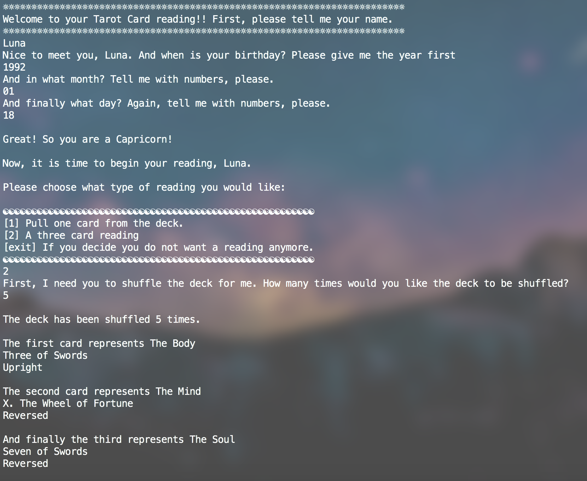

# _Tarot Readings in Ruby_

#### _An interactive Tarot reading game. Created as my final project during the RampUpRuby course at StartUp Institute._

#### By _**Ashley Maceli**_

## Description

_A Ruby Tarot Reading game. The user enters their name and birthday and with the use of the zodiac Ruby Gem can tell the user what their zodiac sign is. The user may shuffle the deck as many times as they wish, choose from a single card or three card reading and may recieve any of the cards in the upright or reversed position._

## Setup/Installation Requirements

* _Have Ruby, RubyGems and Homebrew installed_
* _Clone this repository into your terminal_
* _Enter the file with the command 'cd tarot-reading-ruby'_
* _Install the zodiac ruby gem with the command 'gem install zodiac'_
* _Run the file in terminal with the command 'Week8_Tarot_Reading.rb'_
* _Enjoy as many Tarot readings as you wish_

## Support and contact details

_For all issues and support, please contact:
Ashley Maceli at ashley.maceli@gmail.com_

## Technologies Used

_Ruby, RubyGems, Homebrew_

### License

The MIT License (MIT)

Copyright (c) 2016 Ashley Maceli

Permission is hereby granted, free of charge, to any person obtaining a copy
of this software and associated documentation files (the "Software"), to deal
in the Software without restriction, including without limitation the rights
to use, copy, modify, merge, publish, distribute, sublicense, and/or sell
copies of the Software, and to permit persons to whom the Software is
furnished to do so, subject to the following conditions:

The above copyright notice and this permission notice shall be included in all
copies or substantial portions of the Software.

THE SOFTWARE IS PROVIDED "AS IS", WITHOUT WARRANTY OF ANY KIND, EXPRESS OR
IMPLIED, INCLUDING BUT NOT LIMITED TO THE WARRANTIES OF MERCHANTABILITY,
FITNESS FOR A PARTICULAR PURPOSE AND NONINFRINGEMENT. IN NO EVENT SHALL THE
AUTHORS OR COPYRIGHT HOLDERS BE LIABLE FOR ANY CLAIM, DAMAGES OR OTHER
LIABILITY, WHETHER IN AN ACTION OF CONTRACT, TORT OR OTHERWISE, ARISING FROM,
OUT OF OR IN CONNECTION WITH THE SOFTWARE OR THE USE OR OTHER DEALINGS IN THE
SOFTWARE.
